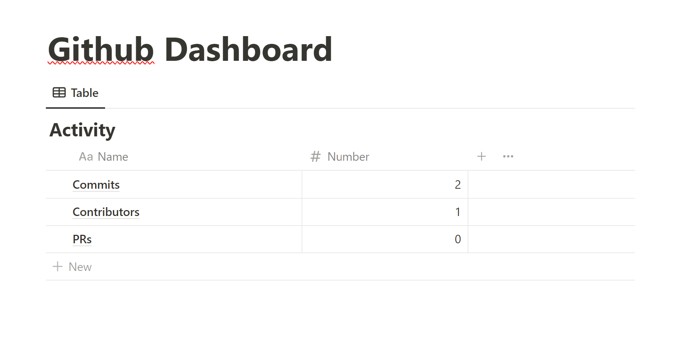

# org4g-notion

## TODO
* ~~Add method to create a database from a template~~
* Find out how to make database inline (does not seem possible from plain API? But this exists in the Javascript SDK so it is surely present)
* Add handling for multiple database ids (Don't need it, every type of database will have it's own specific class. Plus probably a global dashboard page class.)
* Check if DB already exists by name using search api (https://developers.notion.com/reference/post-search)
* get all ids from search API ?
* Turn this into a github action to sync stats when committing on main or when PRs are open/closed/merged
* Migrate

## Current Dashboard

